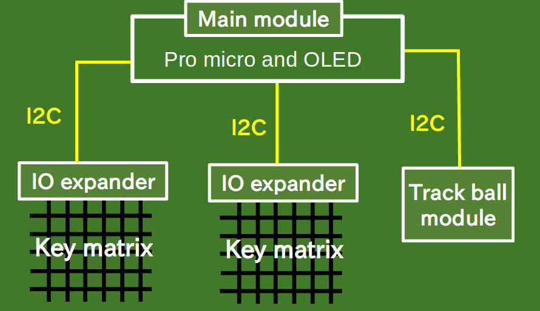

# My best original keyboard
This repository is development one of original keyboard
for me (The name is undecided yet).

Software is developed by [qmk firmware](https://github.com/qmk/qmk_firmware).

## Constitution keyboard
These module are connected with Pro micro as figure.
- 2 I/O expanders (scanning key matrix)
- Displaying current layer on OLED module
- Track ball module (unfinished)

### Features.
- Pro micro can be put favorite place
- Serial LEDs can be added

There may be others.....

## Development record
[Development record](https://github.com/Hiroki-Goto/ori_keyboard/issues)
