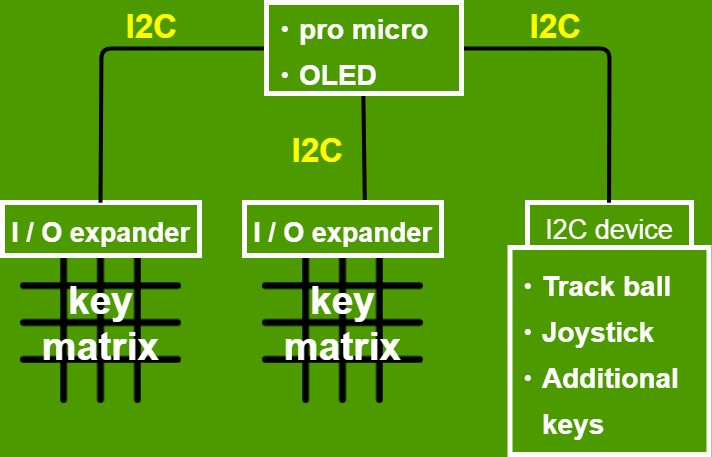

# My best original keyboard
This repository is development one of original keyboard
for me (The name is undecided yet).

Software is developed by [qmk firmware](https://github.com/qmk/qmk_firmware).

## Constitution keyboard
These module are connected with Pro micro as figure.
- 2 I/O expanders (scanning key matrix each other)
- Displaying current layer on OLED module
- Pointing device (uncertain)
    - Track ball module 
    - joystick 

There may be others.....

## Development record
- [software](https://github.com/Hiroki-Goto/qmk_firmware/tree/hiro_test)  

- [Development record](https://github.com/Hiroki-Goto/ori_keyboard/issues)

# Licence
BSD 2-Clause "Simplified" License. see [LICENSE](./LICENSE)