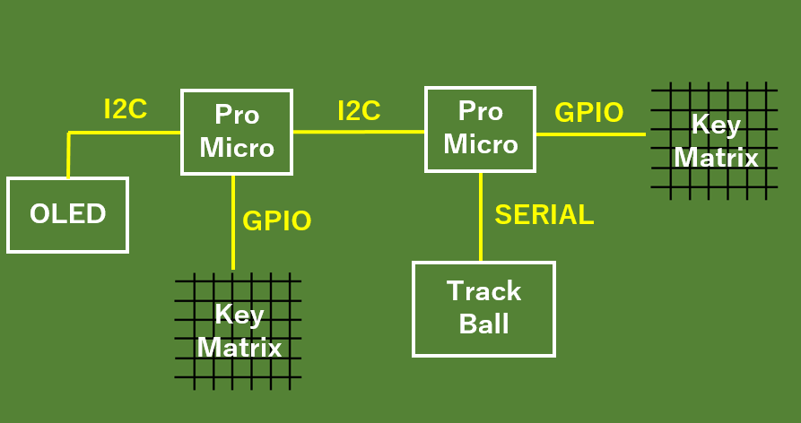
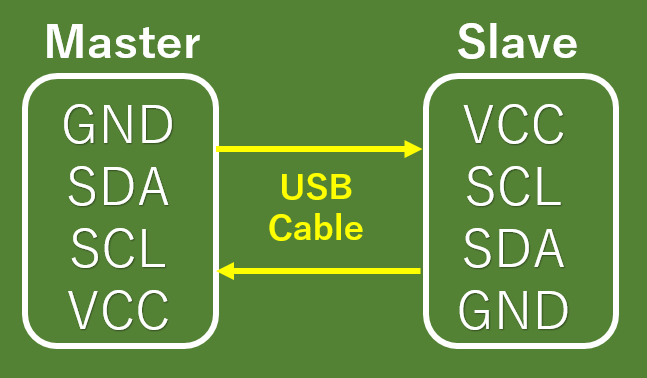

# ori_keyboard
自分にとって良きキーボードを作成するためのリポジトリ（名称は未定）

## キーボードの構成

## 行数を変更する場合
master/とslave/にあるparam.hの
MASTER_COL_NUM、SLAVE_COL_NUM
を変更します。

## レイヤー機能について
現状はレイヤーの値を0xF0以上にすることで対応しています。  
押している間のみレイヤーを変える機能は実装していません。
- レイヤーを追加する場合  
    1. master/param.hにレイヤー、キーマップを追加
    2. master/key.cppにあるchangeLayer関数にcase文を追加
    3. masetr/OLED.cppにあるdisplay関数にcase文を追加（OLEDに表示する場合のみ）

## 左右間の通信
左右の接続はUSBケーブルを使用しています。
通信に関しては下の図を参照してください。  
左右に接続はUSBケーブルで接続してますが、
トラックボールの移動量のデータををシリアル通信で行っているため、
左右間のキーボードはI2Cで通信しています。  

メッセージの規格ついては、
キーマトリックス8ビット＋マウス8ビットの計16ビットで行います（予定）。  
キーマトリックスの送信に関しては5＊７キーボードに対応ができるように以下の方式で送信しています。  
`
Matrix_SendByte = (is_press << 7 || Row*SLAVE_COL_NUM + Col)  
`

